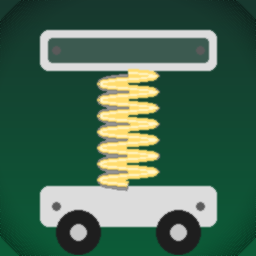

# FS25 Global Suspension Tuner

Globally retunes cab, seat, character-torso and wheel suspension on every vehicle in Farming Simulator 25 — vanilla **and** mods. Includes an auto-generated XML config so you can override values per vehicle.



## What it changes

| Layer | Where it acts |
|---|---|
| **Cab** | All `<suspension node="cabin"/>` entries — pitch suspension that lets the cab nod under braking/acceleration |
| **Seat** | All `<suspension node="seat"/>` entries — vertical bounce |
| **Character torso** | `<suspension useCharacterTorso="true"/>` — driver body sway |
| **Wheels** | Every wheel: spring/damper multipliers + suspension-travel scale |

The wheel layer uses Giants' public `WheelPhysics:setSuspensionMultipliers(spring, damper)` API plus a direct write to `suspTravel` with `isPositionDirty = true`. The cab/seat/torso layer mutates `spec_suspensions.suspensionNodes` directly — `Suspensions:onUpdate` reads those fields every physics tick, so changes take effect immediately without engine API calls.

## Install

1. Download `FS25_GlobalSuspensionTuner.zip` from the releases page (or zip the repo contents).
2. Drop it into `Documents/My Games/FarmingSimulator2025/mods/`.
3. Enable the mod in the in-game mod manager.

## Configure

On first launch the mod creates:

```
<Documents>/My Games/FarmingSimulator2025/modSettings/FS25_GlobalSuspensionTuner.xml
```

Each loaded vehicle is auto-registered there as a `<vehicle match="..." enabled="true"/>` line you can edit afterwards. Edits are picked up on the next game start.

```xml
<globalSuspensionTuner>
    <defaults>
        <cab    weight="800"  minRotation="-2.26 0 0" maxRotation="2.26 0 0" springX="60" damperX="6"/>
        <seat   weight="300"  minTranslation="0 -0.3 0" maxTranslation="0 0.3 0" springY="6" damperY="0.9"/>
        <torso  weight="160"  minRotation="0 -8 -8" maxRotation="0 8 8" springY="5" damperY="0.7" springZ="5" damperZ="0.7"/>
        <wheels suspTravelScale="1.5" suspTravelMax="0.3" springMultiplier="0.3" damperMultiplier="0.3"/>
    </defaults>

    <!-- Auto-discovered vehicles -->
    <vehicle match="data/vehicles/fendt/vario1000/vario1000.xml" enabled="true"/>
    <vehicle match="mods/FS25_FendtFavorit800/favorit800.xml" enabled="true"/>
</globalSuspensionTuner>
```

### Per-vehicle override

Add the attributes you want to change. Anything you leave out inherits from `<defaults>`.

```xml
<vehicle match="fendt/vario1000">
    <cab weight="1000" springX="50"/>
    <wheels springMultiplier="0.5" damperMultiplier="0.5"/>
</vehicle>
```

`match` is a substring search inside the vehicle's `configFileName`, so shortening to `match="vario1000"` matches every variant. The first matching `<vehicle>` entry wins.

### Disable per vehicle

```xml
<vehicle match="trailer" enabled="false"/>
```

## Value reference

### Cab — rotational, pitches around X

| Attribute | Effect |
|---|---|
| `weight` | Cab inertia (kg). Higher = laggier, "heavier" pitch |
| `springX` | Spring stiffness (xml-units, engine ×1000). Higher = stiffer, smaller travel |
| `damperX` | Damping. Higher = settles faster, lower = oscillates more |
| `minRotation` / `maxRotation` | Pitch limits in **degrees** (X Y Z) |

### Seat — translational on Y

| Attribute | Effect |
|---|---|
| `weight` | Seat inertia |
| `springY` | Vertical spring |
| `damperY` | Vertical damping |
| `minTranslation` / `maxTranslation` | Travel range in **meters** (X Y Z) |

### Torso — rotational on Y and Z

Same idea as cab but on the driver's upper body.

### Wheels — multipliers applied to the vehicle's own values

| Attribute | Effect |
|---|---|
| `suspTravelScale` | Multiplier for `suspTravel`. 1.0 = unchanged, 1.5 = 50% more travel |
| `suspTravelMax` | Hard ceiling in meters |
| `springMultiplier` | < 1 softer, 1.0 unchanged, > 1 stiffer |
| `damperMultiplier` | < 1 more body roll/wobble, > 1 calmer |

### Physics rules of thumb

- Eigenfrequency `f ≈ √(spring / weight) / (2π·31.6)` Hz. ~1.5 Hz feels like a tractor cab.
- Damping ratio `ζ ≈ damper / (2·√(spring·weight))`.
  - `ζ ≈ 0.3` — lively, oscillates 2-3×
  - `ζ ≈ 0.5` — natural feel (default profile)
  - `ζ ≈ 0.7` — settles fast
  - `ζ > 1` — overdamped, feels dead

## How it works (brief)

The mod registers a `Specialization` named `globalSuspensionTuner` and attaches it to every vehicle type that has `Suspensions` or `Wheels` (via `TypeManager.validateTypes`). On `onPostLoad`:

- For cab/seat/torso: walks `self.spec_suspensions.suspensionNodes`, classifies each entry by node name (`cabin`, `seat`) or the `useCharacterTorso` flag, and rewrites `weight`, `min/maxRotation`, `min/maxTranslation`, `suspensionParameters` directly.
- For wheels: walks `self.spec_wheels.wheels`, scales `wheel.physics.suspTravel`, marks `isPositionDirty = true`, and calls `WheelPhysics:setSuspensionMultipliers`.

References used during development: `D:\Games\Farming Simulator 25\sdk\debugger\gameSource\dataS\scripts\vehicles\specializations\Suspensions.lua` and `vehicles\wheels\WheelPhysics.lua`.

## Layout

```
FS25_GlobalSuspensionTuner/
├── modDesc.xml
├── icon.png
├── config_default.xml      # reference copy of the embedded defaults
├── _make_icon.py           # regenerates icon.png with PIL
└── src/
    ├── main.lua            # bootstraps spec via TypeManager.validateTypes
    ├── Config.lua          # XML read/write, schemas, per-vehicle merging
    └── GlobalSuspensionTuner.lua  # the spec itself
```

## License

MIT — see [LICENSE](LICENSE).
